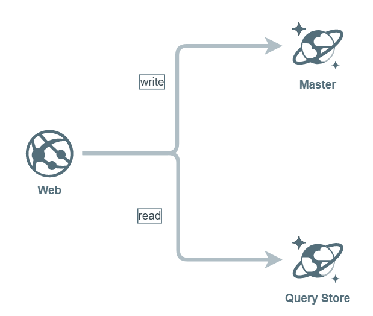
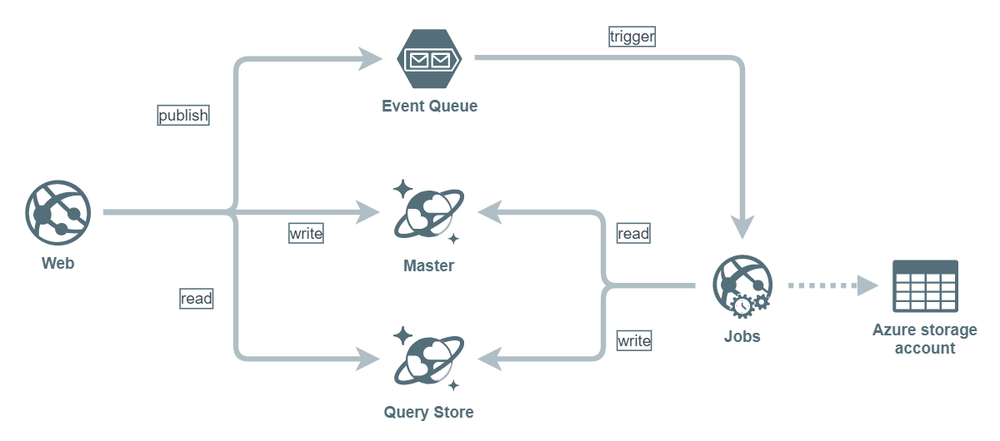
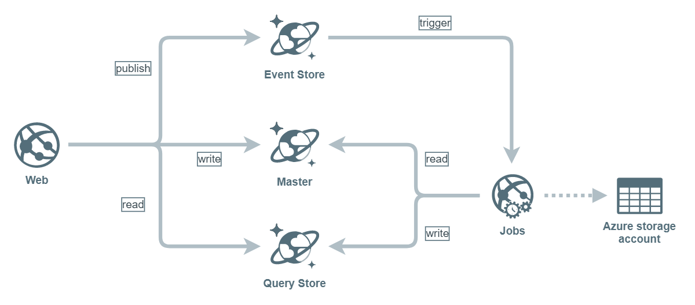

# TODO List POC

(2017)

POC for implementing command-query using different methods of synchronising the read and write data stores.

The POC application is a simple TODO list with basic CRUD functionality.

The list of TODO items is retrieved from a query store which represents the **read model** consisting of all TODO items.

Adding, editing and deleting the TODO items are all done using **commands** which update the primary data store using a separate **write model**. Whenever the TODO items are changed in any way, a domain event is published which then results in the read model being updated.

In the POC application:

- all commands are published and handled *in-process*
- events are used to trigger the sync of the query store with the primary data
- events can be consumed either in or out of process

## Design goals

- strong separation of read and write models and data stores
- application / code structure based on commands, events and handlers (ie. no discrete application layer)
- detection and "handling" of slow updates to the read model

## Technical goals

- use of .NET Core for MVC & WebJob
- use of CosmosDB as a primary data store (via the Mongo API)
- use of CosmosDB for triggering event handling in an Azure WebJob
- use of StorageQueue triggers in an Azure WebJob

## Implementation

The projects in the POC solution are:

- **.Web** - MVC web app
- **.Core** - definitions of read/write models, service interfaces
- **.Handlers** - command and event handlers
- **.Infrastructure** - implementation of services (eg. repositories, queues, query store)
- **.Jobs** - host process for consuming published domain events

Note that numerous elements of a "real" application have been omitted from the POC including logging, error handling, robust validation, automatic retries, tests, etc.

## Prerequisites

Setup:

- install **CosmosDB emulator** (required for main data repository and for event publishing)
  - create **database** `Todos`
  - create collection `Events`
  - create collection `leases` **TBC: not required?**
  - create collection `Items`
  - create collection `ProcessedCommands`
  - create collection `ViewData`

- install **Azure storage emulator** (required if using a storage queue for event publishing)
  - create storage queue `events`

- A **real** Azure storage account is required for running a webjob (even when running locally)
  - add these to the `appsettings.json` file in the Jobs project

- Populate user secrets (required by the web app, example below)

### Example user secrets (for local setup)

The web app is setup to use user secrets.
Here's example content for the secrets based on using local components (note that the password is the hardwired CosmosDB emulator password)

    {
      "MongoDbConnectionDetails": {
        "User": "localhost",
        "Host": "localhost",
        "Password": "C2y6yDjf5/R+ob0N8A7Cgv30VRDJIWEHLM+4QDU5DE2nQ9nDuVTqobD4b8mGGyPMbIZnqyMsEcaGQy67XIw/Jw=="
      },
      "EventQueueConnectionDetails": {
        "ConnectionString": "UseDevelopmentStorage=true"
      }
    }

### Web project settings

You'll need to enable SSL and also specify a startup URL.

There are 3 ways you can run this POC:

1. in-process message handling
2. storage queue based message handling
3. cosmosDB based message handling

### Setup 1: in-proc message handling (simplest)

In the Web project:

- ensure the code in `ItemsChangedEventHandler` is calling the `HandleInProcess` method
- change the IoC configuration to use `StorageQueueEventQueue` for `IEventStore`
- in the Web project ensure the **user secrets** file contains valid values for:
  - `MongoDbConnectionDetails.User`
  - `MongoDbConnectionDetails.Host`
  - `MongoDbConnectionDetails.Password`
  - `EventQueueConnectionDetails.ConnectionString`

You'll need to run just the Web project.

### Setup 2: storage queue based message handling

To use a Storage Queue to transport events and handle using the web job, do this:

- in the **Web** project:
  - ensure the code in `ItemsChangedEventHandler` is calling the `HandleUsingEventStore` method
  - change the IoC configuration to use `StorageQueueEventQueue` for `IEventStore`
- in the **Web** project ensure the **user secrets** file contains valid values for:
  - `MongoDbConnectionDetails.User`
  - `MongoDbConnectionDetails.Host`
  - `MongoDbConnectionDetails.Password`
  - `EventQueueConnectionDetails.ConnectionString`
- in the **Jobs** project, ensure the appsettings.json file contains valid values for:
  - `WebJobsDashboard` (must be an Azure account)
  - `WebJobsStorage` (same as above)
  - `EventQueueConnectionString` (can be emulator or Azure, should match web)
- in the **Jobs** project `Triggers` class, ensure the `TodoEventsStorageQueueTrigger` method is uncommented

You'll need to run both the Web and Jobs projects in this setup.

### Setup 3: CosmosDB based message handling

To use CosomsDB to persist events and handle using the web job, do this:

- in the **Web** project:
  - ensure the code in `ItemsChangedEventHandler` is calling the `HandleUsingEventStore` method
  - change the IoC configuration to use `MongoDbEventStore` for `IEventStore`
- in the **Web** project ensure the **user secrets** file contains valid values for:
  - `MongoDbConnectionDetails.User`
  - `MongoDbConnectionDetails.Host`
  - `MongoDbConnectionDetails.Password`
- in the **Jobs** project, ensure the appsettings.json file contains valid values for:
  - `WebJobsDashboard` (must be an Azure account)
  - `WebJobsStorage` (same as above)
  - `CosmosDbEventsKey` (can be emulator or Azure)
- in the **Jobs** project `Triggers` class, ensure the `TodoEventsCosmosDbTrigger` method is uncommented

You'll need to run both the Web and Jobs projects in this setup.

## Discussion points

Some points worth discussing based on the POC:

- appropriate use of eventual consistency and dealing with latency
- granularity of read models
- performance of consuming events using CosmosDB or message queues (Azure)
- soltion / project / code structure

## Recommendations

1. Although the POC shows how it's potentially possible to use out of process event handling in conjunction with a linear user journey, this is best avoided. The latency between updating the primary data store and synchronising the query store will always be too great if the user is immediately taken to a page where they would expect to see the changed data. In these cases sync the query store in-process if the journey can't be modified

2. Using CosmosDB as the transport for pub/sub of events was relatively **slow** using the trigger attributes. This could be due to how the attribute is implemented and its configuration. Instead consider using the feed processor library

## Addendum: Todo.ChangeFeedProcessor.zip

The zip contains an example project to respond to CosmosDB changes (more quickly than when using the trigger attribute) from a WebJob.

To use the project you'll need to create a new CosmosDB account (note this is separate to the MongoDB-esque CosmosDB account created for the rest of the POC).

In this account create:

- a **todos** database
- a **events** collection
- a **leases** collection

Modify the `program.cs` file to specify the 2 configuration values needed:

- URL of the CosmosDB account (eg. <https://mg-todolist-sql.documents.azure.com/>)
- read-write key for the account (from the Azure portal under CosmosDB > settings > keys)
